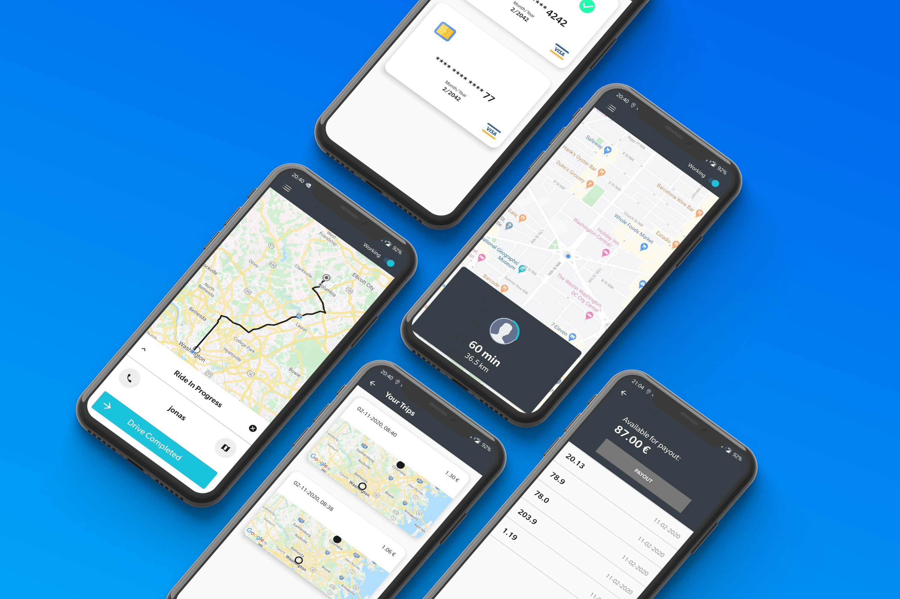

<!-- PROJECT LOGO -->
 

  

  <h3 align="center">Uber Clone</h3>

  

    A Uber clone app made with android native (java) and firebase
     
    <a href="https://github.com/SimCoderYoutube/UberClone/wiki"><strong>Explore the docs »</strong></a>
     
     
    <a href="https://github.com/SimCoderYoutube/UberClone/issues">Report Bug</a>
    ·
    <a href="https://github.com/SimCoderYoutube/UberClone/issues">Request Feature</a>
  

<!-- TABLE OF CONTENTS -->

  
<h2 style="display: inline-block">Table of Contents</h2>

  <ol>
    <li>
      <a href="#about-the-project">About The Project</a>
      <ul>
        <li><a href="#built-with">Built With</a></li>
      </ul>
    </li>
    <li>
      <a href="#getting-started">Getting Started</a>
      <ul>
        <li><a href="#prerequisites">Prerequisites</a></li>
        <li><a href="#installation">Installation</a></li>
      </ul>
    </li>
    <li><a href="#roadmap">Roadmap</a></li>
    <li><a href="#contributing">Contributing</a></li>
    <li><a href="#support">Support</a></li>
    <li><a href="#license">License</a></li>
    <li><a href="#contact">Contact</a></li>
  </ol>

<!-- ABOUT THE PROJECT -->

## ℹ️ About The Project

This repo contains the project made in my youtube chanel called simcoder. This project is a clone of the Uber android app.

It is made using android native with java and some firebase services (authentication, real time database and storage).

In the [master](https://github.com/SimCoderYoutube/UberClone/tree/master) branch you have the redesign project which I was previously selling in my website, however you still have access to the youtube series repo in the [youtube_series](https://github.com/SimCoderYoutube/UberClone/tree/youtube_series)

You can follow the youtube series in the following [link](https://www.youtube.com/watch?v=7HbQx0lwRww&list=PLxabZQCAe5fgXx8cn2iKOtt0VFJrf5bOd&ab_channel=SimCoder)

## 🆕 Getting Started

- ### **Prerequisites**

  - [Android Studio](https://developer.android.com/)
  - [Firebase](https://firebase.google.com/)

<!-- GETTING STARTED -->

- ### **Installation**

  In order to deploy the project you'll need to follow the [wiki page](https://github.com/SimCoderYoutube/UberClone/wiki/Setup-your-project) dedicated to this effect.

## 🚧 Roadmap

See the [open issues](https://github.com/SimCoderYoutube/UberClone/issues) for a list of proposed features (and known issues).

<!-- CONTRIBUTING -->

## ➕ Contributing

Contributions are what make the open source community such an amazing place to be learn, inspire, and create. Any contributions you make are **greatly appreciated**. Please check the [Wiki](https://github.com/SimCoderYoutube/UberClone/wiki/How-to-Contribute)

## 🌟 Show your support

Give a ⭐️ if this project helped you!

And don't forget to subscribe to the [youtube chanel](https://www.youtube.com/c/SimpleCoder?sub_confirmation=1)

## 📝 License

Copyright © 2021 [SimCoder](https://github.com/simcoderYoutube).

This project is [MIT](https://github.com/SimCoderYoutube/UberClone/blob/master/LICENSE) licensed. Some of the dependencies are licensed differently.

<!-- CONTACT -->

## 👤 Contact

**SimCoder**

- Website: www.simcoder.com
- Twitter: [@simcoder_here](https://twitter.com/simcoder_here)
- Github: [@simcoderYoutube](https://github.com/simcoderYoutube)
- Youtube: [SimCoder](https://www.youtube.com/channel/UCQ5xY26cw5Noh6poIE-VBog)
